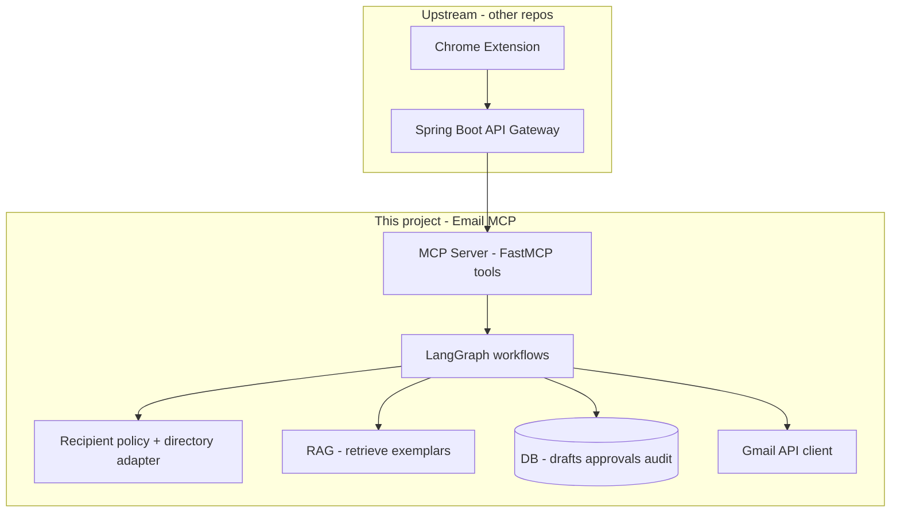

# Email MCP — Project Plan (Pre-Implementation)

This document defines **what will be built**, in **what order**, and **what is explicitly out of scope** for the first iterations. No implementation work should start until this plan is reviewed and approved by the project owner.

---

## 1. Purpose

Deliver an **Email MCP server** (Python) that:

- Helps draft emails using **retrieval-augmented context** from **approved historical company correspondence** (or templates), so tone and structure match Grid Dynamics norms.
- Ensures **all recipients are internal** to the organisation: addresses must satisfy an allowlist policy (primary domain: `@griddynamics.com`; subdomain rules TBD with IT).
- Enforces **human-in-the-loop (HITL)** before any message is sent: a reviewer can edit subject, body, and recipient list; sending only occurs after explicit approval.
- Exposes capabilities through **MCP tools** so a separate orchestrator (e.g. FastAPI MCP host) or future Java gateway can invoke them consistently.

---

## 2. Product Constraints (Non-Negotiables)

| Constraint | Enforcement |
|------------|-------------|
| Internal recipients only | Resolve names via **org directory** (or equivalent); canonicalise to email; **allowlist check** on every `To`/`Cc`/`Bcc` before draft finalisation and again before send. |
| Correct recipients | UI/API shows **display name + email**; approver may add/remove/edit recipients within allowlist rules. |
| Correct content | Approver may **edit** subject/body; model output is **proposal only**. |
| Auditability | Persist **draft versions**, **approver identity**, **timestamp**, and **final payload** reference (or hash) for each send. |

---

## 3. System Boundaries

### 3.1 In scope (this repo — Email MCP + supporting modules)

- MCP tool surface (FastMCP): read thread context, propose draft, manage approval state, send after approval, track reply / no-response helpers (as phased below).
- **LangGraph** (or equivalent) **state machines** for: draft → pending approval → (edit) → send / cancel.
- Gmail API client wrapper (OAuth token supplied by upstream or local dev config — see Phase 0).
- **Recipient policy** module: parse addresses, normalise, allowlist validation.
- **RAG pipeline** (ingestion + retrieval interfaces): embeddings + metadata filters; optional hybrid keyword search later.
- Persistence for **approval workflow + audit** (start with SQLite or Postgres — decision in Phase 0).
- Tests: unit tests for policy and state transitions; mocked Gmail for CI.

### 3.2 Out of scope (owned elsewhere, but integrated later)

- **Chrome extension UI** and **Spring Boot gateway** (authn/z, corporate session, final REST contract). This plan assumes they will call MCP or a thin Python HTTP facade.
- **Google Cloud OAuth consent** registration and **Workspace admin** approvals (project setup is a dependency, not code in this milestone).
- **Authoritative HR/IdP directory**: Email MCP consumes a **directory adapter interface**; first implementation may use a stub or CSV for dev.

---

## 4. High-Level Architecture

**Principle:** Reasoning and multi-step flows live in **LangGraph**; **MCP** exposes **atomic-ish** tools that map to those flows (or thin wrappers). Final send never bypasses the approval checkpoint.

---

## 5. Phased Delivery

### Phase 0 — Foundations (no Gmail required)

**Done when:** Developers can run the service locally with config templates and automated tests pass.

- [x] Repository layout under `email-mcp/`: `app/mcp_server`, `app/workflows`, `app/policy`, `app/gmail`, `app/rag`, `app/storage`, `tests/`.
- [x] Configuration: environment-based settings (allowlist domains, feature flags: `USE_STUB_GMAIL`, `DATABASE_URL`).
- [x] **Recipient policy** module: validate email addresses against allowlist; tests for edge cases (subdomains, plus-addressing).
- [x] **Directory adapter** interface + **stub** implementation (lookup by name → list of candidate emails).
- [x] **Persistence** choice: SQLite for local dev; Postgres-compatible schema for staging/prod.
- [x] **Audit/draft** schema: draft record, version history, approval record, final send record.

### Phase 1 — MCP skeleton + stub Gmail

**Done when:** All MCP tools are callable end-to-end with **stub** responses; LangGraph runs draft → pending approval → approve → stub send.

- [x] FastMCP server registering tools: `resolve_recipients`, `read_thread_stub`, `start_email_send`, `get_workflow_status`, `submit_approval` (covers draft, pending review, approve/cancel, send).
- [x] LangGraph graph with **interrupt / checkpoint** at approval (human can edit state).
- [x] Stub Gmail client implementing the same interface as the real client.
- [x] Tests: graph transitions; policy rejection paths; no send without `approved` state.

### Phase 2 — Real Gmail integration

**Done when:** With valid OAuth tokens, the server can read threads (as scoped) and send **only** the human-approved payload.

- [x] OAuth2 token handling contract: refresh token + client id/secret via `EMAIL_MCP_GOOGLE_*` (MVP); production should vault these or receive tokens from the Java gateway.
- [x] Gmail wrapper: `RealGmailClient` — `users.threads.get`, `users.messages.send`; MCP tools `read_gmail_thread` / `read_thread_stub`.
- [x] Integration tests: `EMAIL_MCP_INTEGRATION=1` optional smoke test; default CI skips without secrets.

### Phase 3 — RAG: knowledge of “how we frame emails”

**Done when:** Draft proposal step retrieves top-k internal exemplars (metadata-filtered) and includes them in the LLM context under strict “do not copy confidential details” instructions.

- [x] Ingestion contract: `app/rag/ingest.py` (chunking, JSONL loader, metadata); **redaction is the caller’s responsibility** before ingest.
- [x] Vector store + embeddings: `InMemoryVectorStore` + `HashEmbeddingProvider` (deterministic, no external API); optional persist `EMAIL_MCP_RAG_STORE_PATH`; bootstrap via `EMAIL_MCP_RAG_CORPUS_PATH` JSONL.
- [x] Retrieval in LangGraph **draft** node: `EMAIL_MCP_RAG_TOP_K`, query = topic + instruction; metadata filters `topic` / `intent` / `team`; MCP: `rag_status`, `rag_ingest_documents`, `rag_search`.
- [ ] **Manual evaluation (you):** compare drafts with `EMAIL_MCP_RAG_MODE=vector` vs `stub`, exemplars ingested, and confirm tone/structure match company norms (no automated metric in v1).

### Phase 4 — Reply tracking & follow-up helpers

**Done when:** Tools can report reply status / no-response against SLAs for threads the system sent (subject to Gmail API capabilities and privacy policy).

- [x] `track_reply_status` / `detect_no_response` with persisted `tracked_sends` rows, SLA deadline (`EMAIL_MCP_REPLY_SLA_HOURS`), Gmail thread refresh + header parsing.
- [x] **Scheduling:** synchronous tools only — run from Spring/cron/Cloud Scheduler/extension on a cadence; see `app/replies/__init__.py` docstring. Optional Celery worker can call the same methods later.

### Phase 5 — Hardening

- [ ] Retries for Gmail 429, token refresh failures, LLM timeouts.
- [ ] Structured logging; trace ids across graph steps.
- [ ] Rate limits and per-user quotas (if required by security review).

---

## 6. Human-in-the-Loop (Detailed Behaviour)

1. **Input:** User provides recipient **names** (and optional topic/intent). System resolves to canonical emails via directory adapter; **policy** rejects non-allowlisted addresses.
2. **Draft:** System retrieves RAG context (Phase 3) and calls LLM to produce **proposed** subject/body.
3. **Pending approval:** State exposed via MCP/read API: full recipient list (name + email), subject, body, draft id.
4. **Edits:** Reviewer updates any field; policy re-validates recipients after each change.
5. **Approve:** Transition to **send**; Gmail sends **exactly** the approved content.
6. **Reject/Cancel:** Terminal state; no send.

---

## 7. Dependencies on the Company / Infra

- Google Workspace: **Internal** OAuth client (or service account strategy if later required — not default in this plan).
- Decision on **subdomains** of `griddynamics.com` and **mailing lists** (`@griddynamics.com` groups).
- Legal/IT sign-off on **mail corpus** used for RAG (retention, PII, customer data).
- Identity of **directory API** for name resolution.

---

## 8. Success Criteria (MVP)

- [ ] No Gmail send without **explicit approval** in persisted workflow.
- [ ] Non-allowlisted recipient cannot reach send (automated tests prove this).
- [ ] Stub mode allows full demo without Google credentials.
- [ ] With credentials, one end-to-end send succeeds in a test Workspace account.

---

## 9. Review & Sign-Off

| Role | Name | Date | Approved (Y/N) |
|------|------|------|----------------|
| Project owner | | | |
| Security / IT | | | |

**Change control:** Updates to allowlist rules, RAG data sources, or OAuth scope must be reflected in this document and re-approved.

---

*Document version: 1.0 — Created for pre-implementation alignment. Update as phases complete.*
